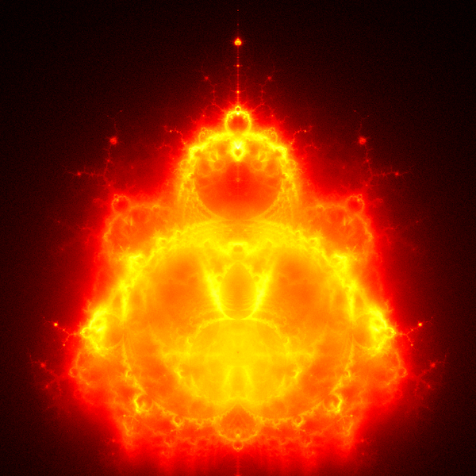

# Buddhabrot

<p align="center">
  
</p>

<p align="center"><em>150 million orbits, 1000×1000, rendered by <code>buddhabrot.bas</code> in under two minutes.</em></p>

The usual Mandelbrot picture colours each point by how long it takes to escape. This one asks a
different question — **where do the escaping orbits go on their way out?** — and answers it by
throwing millions of random points at the plane, following the ones that escape, and counting how
often each pixel is passed through. The result is a density map. Turned a quarter turn, it looks like
a seated figure, which is where the name comes from.

**The colour is a third question, not a palette.** Each channel counts a different band of orbit
lifetime: blue holds the ones that died within fifty steps, green fifty to five hundred, red
everything longer. Nine escaping orbits in ten die young and are barely more than the random point
they started from — so the flat haze that used to swamp a single-channel render now has somewhere to
go, and it goes to blue. The structure is red because only red has it.

The demo exists to make one thing visible: **how much faster SedaiBasic's compiled engines are than
its bytecode interpreter.** Every frame gets the same slice of wall-clock time whichever engine is
underneath, so the frame rate never changes — what changes is how much of the picture has appeared.

---

## Running it

```bash
./build.sh sb --window            # once: sb with the SDL2 window presenter
```

Then, from the repository root:

```bash
bin/x86_64-linux/sb --window bas/demo/buddhabrot/buddhabrot.bas                    # interpreter
bin/x86_64-linux/sb --window bas/demo/buddhabrot/buddhabrot.bas --jit label=JIT    # JIT
bin/x86_64-linux/sb --window bas/demo/buddhabrot/buddhabrot.bas --aot label=AOT    # AOT
```

Or all three at once, on the same seed, to watch them diverge:

```bash
bash bas/demo/buddhabrot/compare_engines.sh
```

Keys while it runs:

| | |
|---|---|
| **SPACE** pause · **R** restart · **S** save a still · **Q** quit | |
| **C** cycle the reading · **[** **]** move the tone curve · **+** **−** halve or double the iteration ceiling | |
| **Z** **X** zoom · **W A S D** pan · **0** back to the whole figure | |

### The three readings

The colour is a third question about the data, not a palette. **NEBULA** (the default) sends
long-lived orbits to red and short-lived ones to blue — the structure is red because only the red
plane holds it, the haze is blue because blue holds nothing else. **AURORA** exchanges those two: a
warm haze around a cold figure, an inversion of *which lifetime you are looking at* rather than of
the picture. **EMBER** adds the three planes back together through one warm ramp, which is the
single-channel Buddhabrot everyone has seen, and loses the lifetime along with the colour.
`palette=nebula|aurora|ember` and `gamma=` do the same from the command line.

### Zooming shows you why Metropolis-Hastings exists

⚠️ **A Buddhabrot zoom is not like any other fractal zoom, and this is the most interesting thing in
the demo.** A Mandelbrot zoom narrows both what you draw and what you compute. Here the view narrows
but the sampling cannot, because an orbit that crosses your zoomed window may have started anywhere —
so you go on tracing the whole plane and throw away everything that misses.

Measured, ten million orbits at each step, brightest pixel in the red channel:

| zoom | peak count |
|---:|---:|
| ×1 | 3 108 |
| ×2 | 711 |
| ×4 | 188 |
| ×8 | 111 |

About a quarter of the signal survives each doubling. Four or five steps in, the picture stops
converging in any useful time — and that is the whole reason Metropolis-Hastings sampling was
invented: instead of drawing points uniformly, mutate one already known to produce a long orbit
through your window. This demo is deliberately uniform, so what you are watching is the problem
rather than the solution.

### Without a window

```bash
bin/x86_64-linux/sb bas/demo/buddhabrot/buddhabrot.bas --aot still=20000000 out=/tmp/b.ppm
```

`still=` traces a fixed number of orbits, writes a binary PPM and exits. Every image on this page was
made that way. Run `... buddhabrot.bas help=1` for the full argument list.

## The three engines are one binary

There are no three executables to build. SedaiBasic ships a single `sb`, and `--jit` and `--aot`
select which engine runs the loaded program:

| build | size |
|---|---|
| `./build.sh sb` (headless, the regression target) | 4 134 024 bytes |
| `./build.sh sb --window` (adds the SDL2 presenter) | 4 143 016 bytes |

The engine is bound when the program is **loaded** — the JIT builds its native loops and the AOT
compiler compiles its functions before the first instruction runs — so it cannot be changed by a
keystroke half-way through a run. That is why the comparison is a script that launches three
processes rather than a key in the demo. `compare_engines.sh` gives all three the same seed, so the
three windows are computing an identical image and the only difference is how fast it arrives.

## What it actually does

Measured on this machine (AMD, Linux, single thread), tracing two million orbits with `still=`:

| engine | seconds | orbits per second | against the interpreter |
|---|---:|---:|---:|
| bytecode interpreter | 2.51 | 798 000 | — |
| JIT | 0.92 | 2 180 000 | 2.7× |
| AOT | 0.61 | 3 260 000 | **4.1×** |

Live, in a six-second run at the default 60 frames a second. The left-hand column is the point: it
does **not** move.

| engine | frames per second | orbits traced in 6 s |
|---|---:|---:|
| bytecode interpreter | 58 | ~4.0 million |
| AOT | 58 | ~17.3 million |

The demo prints both numbers when it exits, so this table can be reproduced rather than believed.
The orbit counts move by a percent or two between runs; the frame rate does not move at all, which
is the whole claim.

**The frame rate is a budget, not a limit.** With no sampling at all the same loop reaches 227 frames
a second interpreted and 317 under AOT, so 60 leaves room to spare.

> **This used to be a much sadder table, and it is worth keeping the before.** Until 1 September 2026
> the AOT backend had no native lowering for `PSet`: every pixel became a runtime-helper call that
> flushed and reloaded every allocated register, 60 ns against the interpreter's 4. Painting was
> therefore a tax that fell hardest on the *fastest* engine, and asking for more frames made the
> compiled engine look worse — at 20 fps the AOT traced 3.31× the interpreter's orbits, at 30 fps
> 2.97×, at 60 fps **1.83×**. The demo was reporting a defect in the engine as if it were a property
> of compilation. `PSet` is now an inline store (SedaiAot C8) at 1.1 ns per call, the tax is gone,
> and the same measurements read 4.13× at 30 fps and 4.32× at 60.

The live ratio is smaller than 4.1×, and the reason is worth stating plainly because it works
*against* the demo's own headline. Painting the window is one `PSet` per pixel, and `PSet` costs
about **4 ns per call under the interpreter, about the same under the JIT, and about 60 ns under
AOT** — measured flat at 100×100, 200×200 and 400×400, so it is a per-call cost rather than a fixed
overhead per frame. A full 400×400 repaint is about 0.75 ms, 0.75 ms and 9.5 ms respectively.

The live ratio now matches the compute-only one, because painting costs all three engines about the
same share of a frame. Per `PSet` call: 4.4 ns interpreted, 4.8 ns under the JIT, **1.1 ns under
AOT**. A full 400×400 repaint is 0.70 ms, 0.78 ms and 0.17 ms.

Getting there is the demo's other story. `PSet` used to cost 60 ns under AOT — the compiled engine
was fifteen times *slower* than the interpreter at the one thing it does most often here — because it
had no native lowering and every pixel went through the runtime helper. Building this demo is what
measured it; fixing it was the same move this project had already made three times, for strings,
records and `PRINT`. The interpreter's speed, for its part, is not the interpreter: it is the C hot
dispatch loop. Run it with `HOTC_OFF=1` and a pixel costs 32 ns.

## The same image, four ways of computing it

```bash
bash bas/demo/buddhabrot/verify_determinism.sh
```

Traces the same orbits under the interpreter, the JIT, the AOT compiler and the interpreter with the
optimiser switched off, then compares SHA-256 hashes of the four output files. They must be
identical, and they are.

This matters more than it sounds. The image depends on a floating-point comparison — *has this orbit
passed radius 2 yet?* — made tens of millions of times. If any engine rounded differently anywhere,
one orbit would cross a step early and the pictures would part company. The check is also why the
random numbers come from five lines of xorshift written out in the source rather than from the
runtime's `RND`.

## Reading the source

`buddhabrot.bas` is meant to be read, and it is the point of the demo as much as the picture is. The
whole algorithm is one subroutine, `TraceOneOrbit`, and it fits on a screen. Everything above it is
preparation, everything below it is presentation.

The header lists the five things that are easy to get wrong — the orbit that must be buffered before
it is accumulated, the two regions that never escape, the mirror symmetry, the iteration floor, and
the tone curve — and each one is called out again at the line where it matters. The optimisations
that were deliberately *not* made are listed at the foot of the file, with the reason each was
rejected.

## Credit

The technique is Melinda Green's, first described in 1993; the name is Lori Gardi's. This
implementation is independent — written from the mathematical description of the algorithm, with no
existing Buddhabrot source consulted. See [IMPLEMENTATIONS.md](IMPLEMENTATIONS.md) for the genealogy
of the idea and for how other languages express the same algorithm.

## Licence

GPL-3.0-or-later. See [LICENSE](LICENSE) in this directory.
