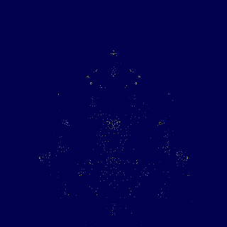

# Buddhabrot

<p align="center">
  
</p>

<p align="center"><em>150 million orbits, 1000×1000, rendered by <code>buddhabrot.bas</code> in under two minutes.</em></p>

The usual Mandelbrot picture colours each point by how long it takes to escape. This one asks a
different question — **where do the escaping orbits go on their way out?** — and answers it by
throwing millions of random points at the plane, following the ones that escape, and counting how
often each pixel is passed through. The result is a density map. Turned a quarter turn, it looks like
a seated figure, which is where the name comes from.

<p align="center">
  
</p>

<p align="center"><em>One run, 80 million orbits, 48 frames taken along the way — the first at a
five-thousandth of the finish.</em></p>

The frames are spaced so that frame <em>k</em> of <em>N</em> falls at <code>(k/N)<sup>p</sup></code>
of the total, and that shape is doing two jobs. Convergence is fast at the start and slow at the
end, so evenly spaced frames would spend nearly the whole film on the part where nothing changes.
And the relative step shrinks as it runs, so the picture **settles** instead of being cut off
mid-climb: measured, the mean brightness moves by about +6 per frame at the start and +0.3 at the
end. A constant ratio — which is what this did first — keeps the step even to the last frame, and
the film ends still visibly moving.

**The colour is a third question, not a palette.** Each channel counts a different band of orbit
lifetime: blue holds the ones that died within fifty steps, green fifty to five hundred, red
everything longer. Nine escaping orbits in ten die young and are barely more than the random point
they started from — so the flat haze that used to swamp a single-channel render now has somewhere to
go, and it goes to blue. The structure is red because only red has it.

The demo exists to make one thing visible: **how much faster SedaiBasic's compiled engines are than
its bytecode interpreter.** Every frame gets the same slice of wall-clock time whichever engine is
underneath, so the frame rate never changes — what changes is how much of the picture has appeared.

---

## Running it

```bash
./build.sh sb --window            # once: sb with the SDL2 window presenter
```

Then, from the repository root:

```bash
bin/x86_64-linux/sb --window bas/demo/buddhabrot/buddhabrot.bas                    # interpreter
bin/x86_64-linux/sb --window bas/demo/buddhabrot/buddhabrot.bas --jit label=JIT    # JIT
bin/x86_64-linux/sb --window bas/demo/buddhabrot/buddhabrot.bas --aot label=AOT    # AOT
```

Or all three at once, on the same seed, to watch them diverge:

```bash
bash bas/demo/buddhabrot/compare_engines.sh
```

Keys while it runs:

| | |
|---|---|
| **H** the key list, on the picture — any key closes it, and it pauses while it is up | |
| **SPACE** pause · **R** restart · **P** save a still · **Q** quit | |
| **C** cycle the reading · **,** **.** move the tone curve · **−** **+** halve or double the iteration ceiling | |
| **Z** **X** zoom · **W A S D** pan · **0** back to the whole figure | |
| **left click** or **wheel up** zoom in on the pointer · **right click** or **wheel down** zoom out | |

The pointer is the one that matters. `W A S D` walk the view half a window at a time, which is all a
keyboard can do — to reach a filament you can *see*, you walk towards it and correct, and every
correction throws the picture away and starts it again. Clicking on it is one move. The overlay
prints the complex coordinate under the pointer as you go.

### How big a window, and which engine can hold it

The frame rate is a budget covering sampling *and* painting, so the picture size is really a question
about the paint. Measured on this machine, milliseconds per frame and the rate held:

| | interpreter | JIT | AOT |
|---|---|---|---|
| 400×400 | 9 ms · **53 fps** | 9 ms · **58 fps** | 1 ms · **58 fps** |
| 600×600 | 20 ms · 25 fps | 21 ms · 36 fps | 2 ms · **58 fps** |
| 800×800 | 36 ms · 14 fps | 37 ms · 21 fps | 3 ms · **58 fps** |

400 is the default because it is the largest window where *every* engine holds the rate, which is the
demo's whole claim: the frame rate does not move, only the amount of picture does. `size=800` is
worth trying under `--aot`, where it still holds 58 — but there the demo becomes a different one,
because the frame rate starts separating the engines instead of the orbit count. Note also that the
JIT does not accelerate the paint at all: it compiles hot loops, and the paint loop's body is a call.

### The three readings

The colour is a third question about the data, not a palette. **NEBULA** (the default) sends
long-lived orbits to red and short-lived ones to blue — the structure is red because only the red
plane holds it, the haze is blue because blue holds nothing else. **AURORA** exchanges those two: a
warm haze around a cold figure, an inversion of *which lifetime you are looking at* rather than of
the picture. **EMBER** adds the three planes back together through one warm ramp, which is the
single-channel Buddhabrot everyone has seen, and loses the lifetime along with the colour.
`palette=nebula|aurora|ember` and `gamma=` do the same from the command line.

> **The keys work in a window now, and on Linux they never had.** `TTerminalInput` — the only key
> source the CLI has — is one big `{$IFDEF WINDOWS}`, so on Unix it could never report a keypress;
> and once an SDL window has the focus the keystrokes are going there anyway, where nothing was
> collecting them. Two halves that each explained the other's absence, and between them every
> documented key of every windowed demo did nothing. The presenter collects them now.

### The picture used to go backwards, and now it does not

Watching it converge, red structure would appear and then **suddenly vanish**, and the brightness
would move back and forth as if the evolution were running both ways. It was real and it is
measurable: each channel was divided by its own brightest pixel, and that single pixel is the
noisiest statistic in the whole picture. Measured at 200×200, the red maximum went 166 → 280 → 412 →
803 over twenty frames, and **every jump renormalises every pixel downwards at once** — on one frame
23 240 pixels of 40 000 got darker while 13 372 got brighter. Early on it is worse: a channel with
almost no data has a maximum of 2 or 3, so everything in it sits at full brightness and then
collapses when the real range appears.

Each channel is now divided by **a constant times the plane's mean**, and the three parts of that are
each load-bearing:

- **The mean, not the maximum or a percentile.** Measured over 120 frames on the red plane, the worst
  one-frame jump is ×1.75 for the maximum, ×1.65 for the 99.9th percentile and ×1.46 for the mean —
  and the percentile is not even monotone, falling on 3 frames of 119. The mean is a sum over 40 000
  pixels, so it is the quietest statistic available, and it tracks the orbits drawn to within 3%
  across a twenty-five-fold range.
- **A function of the data alone**, which is what makes still mode and the browser agree. The first
  attempt measured a rate once and kept it, and *when* it measured depended on how often the picture
  was repainted — so the module's picture stopped matching `sb`'s, 17% of the bytes and up to 149
  levels apart. The net caught that within a minute.
- **A floor**, because early on the mean is a fraction of one count and every pixel would clip to
  white and then resolve downwards — the same disappearing act arrived at from the other side.

Measured over 90 frames: pixels dropping more than twelve levels in a single frame fall from **6 522
to 1 108**, and the frames that used to collapse (2 704 pixels in one step) now move by single
figures. The converged picture is the same picture: at two million orbits it differs from the old
one on 3.7% of its bytes and **by exactly one level** everywhere it differs. `norm=peak` restores the
old behaviour for comparison.

### Zooming shows you why Metropolis-Hastings exists

⚠️ **A Buddhabrot zoom is not like any other fractal zoom, and this is the most interesting thing in
the demo.** A Mandelbrot zoom narrows both what you draw and what you compute. Here the view narrows
but the sampling cannot, because an orbit that crosses your zoomed window may have started anywhere —
so you go on tracing the whole plane and throw away everything that misses.

Measured, ten million orbits at each step, brightest pixel in the red channel:

| zoom | peak count |
|---:|---:|
| ×1 | 3 108 |
| ×2 | 711 |
| ×4 | 188 |
| ×8 | 111 |

(Click where you want to go: each click centres the view on the point under the pointer and halves
the span, which is how that table was collected.)

**And it is the algorithm, not the implementation** — which is worth separating, because from the
outside they look the same. Measured at each zoom, 400 000 orbits: the orbits per second do not move
(338 000 at ×1, 364 000 at ×16 — slightly *faster*, because fewer points land in the window and there
is less to write), and the orbits accepted are identical to the last one. What collapses is only how
much of that work lands where you are looking.

About a quarter of the signal survives each doubling. Four or five steps in, the picture stops
converging in any useful time — and that is the whole reason Metropolis-Hastings sampling was
invented: instead of drawing points uniformly, mutate one already known to produce a long orbit
through your window. This demo is deliberately uniform, so what you are watching is the problem
rather than the solution.

### Without a window

```bash
bin/x86_64-linux/sb bas/demo/buddhabrot/buddhabrot.bas --aot still=20000000 out=/tmp/b.ppm
```

`still=` traces a fixed number of orbits, writes a binary PPM and exits. Every image on this page was
made that way; `series=N` adds N numbered stills along the route, which is how the film above was
made — one run, so every frame comes from the same orbits as the last one. Run `... buddhabrot.bas help=1` for the full argument list.

## In the browser

<p align="center"><code>buddhabrot.html</code> — open it, nothing to install.</p>

`sbc --target wasm` compiles **the same `buddhabrot.bas`** to a WebAssembly module, and
`buddhabrot.html` carries that module inside it as base64: one file, no server, no toolchain, no
runtime library. Click the picture to zoom in on what you clicked, right-click to zoom out; the
buttons do what the keys do natively.

```bash
sbc bas/demo/buddhabrot/buddhabrot.bas --target wasm buddhabrot.wasm
bash bas/demo/buddhabrot/verify_wasm.sh          # compiles it, runs it, checks the picture
```

**It is the same source, not a port.** The browser build differs by what is *compiled out* of it —
`#if __SB_WASM__` — and the list is short and each entry has a reason:

| compiled out | because |
|---|---|
| the 24-pixel text band, `Draw String` | the overlay is HTML in the browser |
| `ScreenLock` / `ScreenUnlock` | there is no presenter to hold back; the page reads the framebuffer when it is ready |
| `WritePortablePixmap` | a module has no filesystem, and the backend says so rather than emitting something that runs and lies |
| the still mode and the live `InKey` loop | the page owns the clock — a module that looped until Q would freeze the tab |

Everything that decides a *pixel* — the sampler, the three planes, the tone curve, the three
readings, the zoom — is the same code compiled twice. Which is checkable, and is checked:
`verify_wasm.sh` runs the module under Node for the same orbits `sb` traces and requires the two
framebuffers to hash the same. They do, byte for byte. It also refuses to pass if `buddhabrot.html`
carries an older module than the source compiles to, because a stale page looks perfectly fine and is
showing something else.

Measured on the same machine, the same two million orbits:

| | orbits per second | against the interpreter |
|---|---:|---:|
| bytecode interpreter | 391 000 | — |
| **WebAssembly (Node 20, V8)** | **923 000** | **2.4×** |
| JIT | 1 401 000 | 3.6× |
| AOT | 1 381 000 | 3.5× |

The module is 25 KB; the page that carries it is 43 KB.

## The three engines are one binary

There are no three executables to build. SedaiBasic ships a single `sb`, and `--jit` and `--aot`
select which engine runs the loaded program:

| build | size |
|---|---|
| `./build.sh sb` (headless, the regression target) | 4 142 376 bytes |
| `./build.sh sb --window` (adds the SDL2 presenter) | 4 151 400 bytes |

The engine is bound when the program is **loaded** — the JIT builds its native loops and the AOT
compiler compiles its functions before the first instruction runs — so it cannot be changed by a
keystroke half-way through a run. That is why the comparison is a script that launches three
processes rather than a key in the demo. `compare_engines.sh` gives all three the same seed, so the
three windows are computing an identical image and the only difference is how fast it arrives.

## What it actually does

Measured 2 September 2026 on an Intel Core Ultra 9 185H (Linux, single thread, pinned to one
performance core), tracing two million orbits with `still=` — computing only, nothing painted:

| engine | seconds | orbits per second | against the interpreter |
|---|---:|---:|---:|
| bytecode interpreter | 5.11 | 391 000 | — |
| JIT | 1.43 | 1 401 000 | 3.6× |
| AOT | 1.45 | 1 381 000 | 3.5× |

Live, in a six-second run at the default 60 frames a second and 400×400. The left-hand column is the
point: it does **not** move.

| engine | frames per second | orbits traced in 6 s | against the interpreter |
|---|---:|---:|---:|
| bytecode interpreter | 58 | ~730 000 | — |
| JIT | 58 | ~4 070 000 | 5.6× |
| AOT | 58 | ~7 400 000 | **10.1×** |

The demo prints both numbers when it exits, so this table can be reproduced rather than believed.
The orbit counts move by a percent or two between runs; the frame rate does not move at all, which
is the whole claim.

**The live ratio is bigger than the compute-only one, and that is not a contradiction.** A frame is
sampling *plus* painting inside one budget, so an engine that paints faster has more of the budget
left to sample with. A full 400×400 repaint costs **7.4 ms interpreted and 0.76 ms under AOT** — so
of a 16.6 ms frame the interpreter has 9 ms left to trace orbits in and the AOT has 15.8.

> **Both halves of that were defects, and both were found by building this demo.**
>
> Until 1 September the AOT had no native lowering for `PSet`: every pixel was a runtime-helper call
> that flushed and reloaded every allocated register, 60 ns against the interpreter's 4. Painting was
> a tax that fell hardest on the *fastest* engine — at 60 fps the AOT's advantage collapsed to 1.83×.
> `PSet` became an inline store (SedaiAot C8) at 1.1 ns a call.
>
> That fixed less than it looked, and the reason is worth knowing. On 2 September the AOT still held
> only **43** frames a second where the interpreter and the JIT held 58, and traced *fewer* orbits
> than the interpreter. `RGB()` was still a helper call — and a helper call zeroes the surface
> descriptor that C8's inline store is gated on, so an `RGB` immediately before a `PSet` took the
> `PSet` off its fast path too, **on every pixel**. `PSet (x, y), RGB(r, g, b)` is how every graphics
> program in this language paints: the two are one hot pair, and covering only one of them covered
> neither. `RGB` is now four masks and three shifts of inline code (C10), and the pixel loop went from
> 20.5 ms a frame to 0.76 — with `AOT_GFXRGB=0` on the same binary to prove which change did it.

The interpreter's own speed, for its part, is not the interpreter: it is the C hot dispatch loop. Run
it with `HOTC_OFF=1` and a pixel costs 32 ns instead of 4.4.

## The same image, four ways of computing it

```bash
bash bas/demo/buddhabrot/verify_determinism.sh
```

Traces the same orbits under the interpreter, the JIT, the AOT compiler and the interpreter with the
optimiser switched off, then compares SHA-256 hashes of the four output files. They must be
identical, and they are. `verify_wasm.sh` adds a fifth: the WebAssembly module's framebuffer, from
the same orbits, hashes the same as all four.

This matters more than it sounds. The image depends on a floating-point comparison — *has this orbit
passed radius 2 yet?* — made tens of millions of times. If any engine rounded differently anywhere,
one orbit would cross a step early and the pictures would part company. The check is also why the
random numbers come from five lines of xorshift written out in the source rather than from the
runtime's `RND`.

## Reading the source

`buddhabrot.bas` is meant to be read, and it is the point of the demo as much as the picture is. The
whole algorithm is one subroutine, `TraceOneOrbit`, and it fits on a screen. Everything above it is
preparation, everything below it is presentation.

The header lists the five things that are easy to get wrong — the orbit that must be buffered before
it is accumulated, the two regions that never escape, the mirror symmetry, the iteration floor, and
the tone curve — and each one is called out again at the line where it matters. The optimisations
that were deliberately *not* made are listed at the foot of the file, with the reason each was
rejected.

## Credit

The technique is Melinda Green's, first described in 1993; the name is Lori Gardi's. This
implementation is independent — written from the mathematical description of the algorithm, with no
existing Buddhabrot source consulted. See [IMPLEMENTATIONS.md](IMPLEMENTATIONS.md) for the genealogy
of the idea and for how other languages express the same algorithm.

## Licence

GPL-3.0-or-later. See [LICENSE](LICENSE) in this directory.
